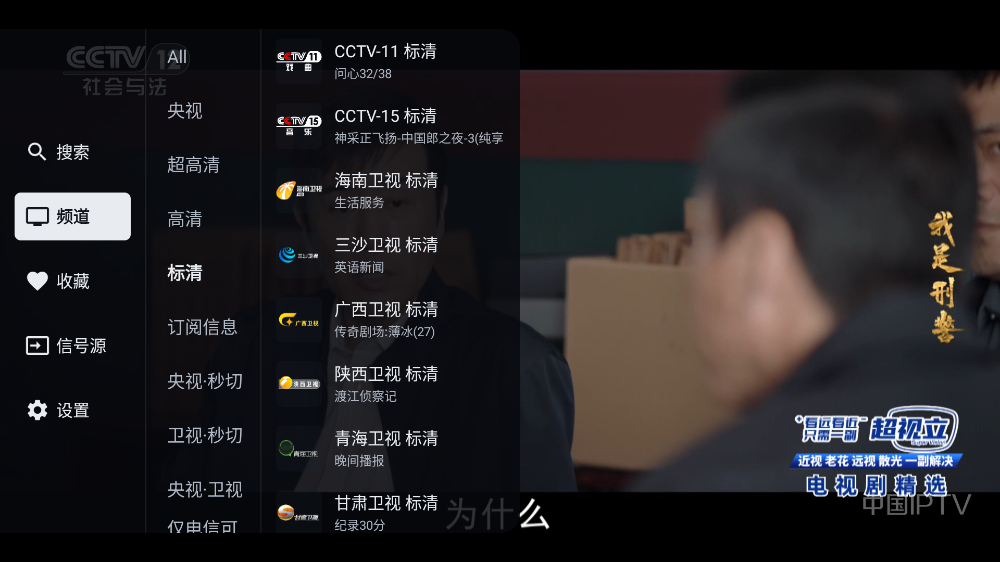
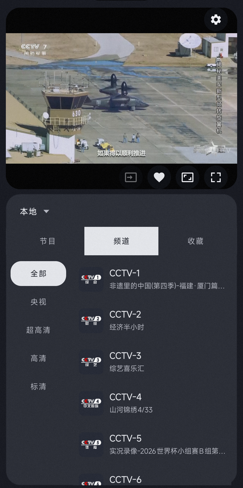

## 观屿TV（VoyaTV）

面向 Android TV、电视盒子和安卓手机的 IPTV 电视直播播放器，支持 M3U/M3U8/TXT 播放列表、XMLTV EPG 节目单、频道收藏和频道预加载。

**应用不提供直播源，也不托管频道内容，使用前需自行导入有权访问的播放列表。**

## 来源与兼容性

- [官方网站](https://xptv.nb9.xyz/)
- [官方使用说明](https://xptv.nb9.xyz/usage)
- [历史版本与更新说明](https://xptv.nb9.xyz/downloads)
- 系统要求：Android 6.0 及以上，支持电视、盒子与手机自适应界面。
- 包名：`xyz.nb9.xptv`。

## 下载地址

当前收录版本：**v0.5.3**（versionCode：71）。以下链接均来自官网，提供官方原版 APK，未做二次打包。

| 版本 | 官方下载 | 适用说明 |
| ---- | -------- | -------- |
| 标准版 | [voyatv-tv-0.5.3.apk](https://xptv.nb9.xyz/releases/download/6442d544-d698-424e-8171-9882eaabf567) | 电视、盒子和安卓手机通用；可在支持的电视系统上设为默认桌面。 |
| NoLauncher 版 | [voyatv-tv-no-launcher-0.5.3.apk](https://xptv.nb9.xyz/releases/download/767bba2f-fee7-4671-9967-156089ce7f4c) | 播放功能相同，不包含默认桌面能力；TCL、雷鸟等限制桌面应用的电视建议选择此版。 |

后续版本请到[官网](https://xptv.nb9.xyz/)下载，或在应用内“设置 → 软件更新”中检查更新。

## 使用说明

1. 安装后进入“设置 → 信号源管理”，添加播放列表地址，或导入本地 `.m3u`、`.m3u8`、`.txt` 文件。
2. 可为信号源配置 XMLTV EPG 地址，查看频道节目单。
3. 支持 HLS/M3U8、RTSP、RTP/UDP、HTTP/HTTPS 播放地址；实际播放效果取决于直播源、网络和设备解码能力。

## 安装包校验

作者已确认以上官方原版 APK 不含恶意代码。两个安装包均已通过 APK v1/v2 签名验证，下载文件的 SHA-256 与官网发布信息一致。

| 文件 | SHA-256 |
| ---- | ------- |
| `voyatv-tv-0.5.3.apk` | `b13246618538b69796d5c4f7b41ab47ddec3f8d15ccf0191b344e83fd751df74` |
| `voyatv-tv-no-launcher-0.5.3.apk` | `77877a1050765880b997e14e801f379d9e14ac0e11203c1d868eb7eb1f0b88bd` |

## 测试记录

- 测试时间：2026-09-23 10:30（北京时间，UTC+8）。
- 测试环境：Android TV 模拟器，Android 16 / API 36，arm64-v8a，1920×1080。
- 标准版 v0.5.3：安装成功，完成首次启动设置，可进入主界面，显示“未配置信号源”和“前往添加信号源”入口。
- NoLauncher 版 v0.5.3：已核验下载文件的 SHA-256 和 APK 签名，未进行安装运行测试。

## 应用截图

以下为作者提供的项目现有截图，与官网使用的图片一致，用于展示电视和手机界面；并非上述安装、启动验证过程中重新拍摄。画面中的频道来自用户自行配置的信号源。

### 电视端频道浏览

### 手机端播放与频道列表

